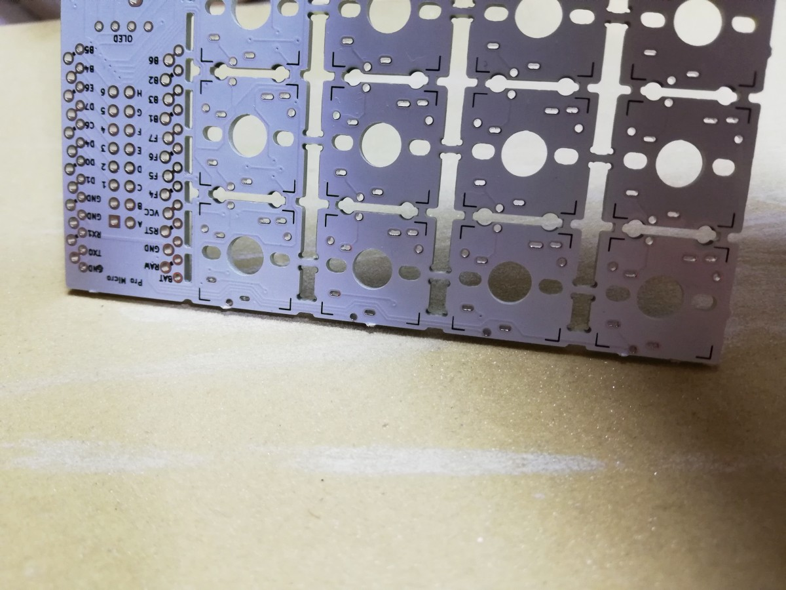
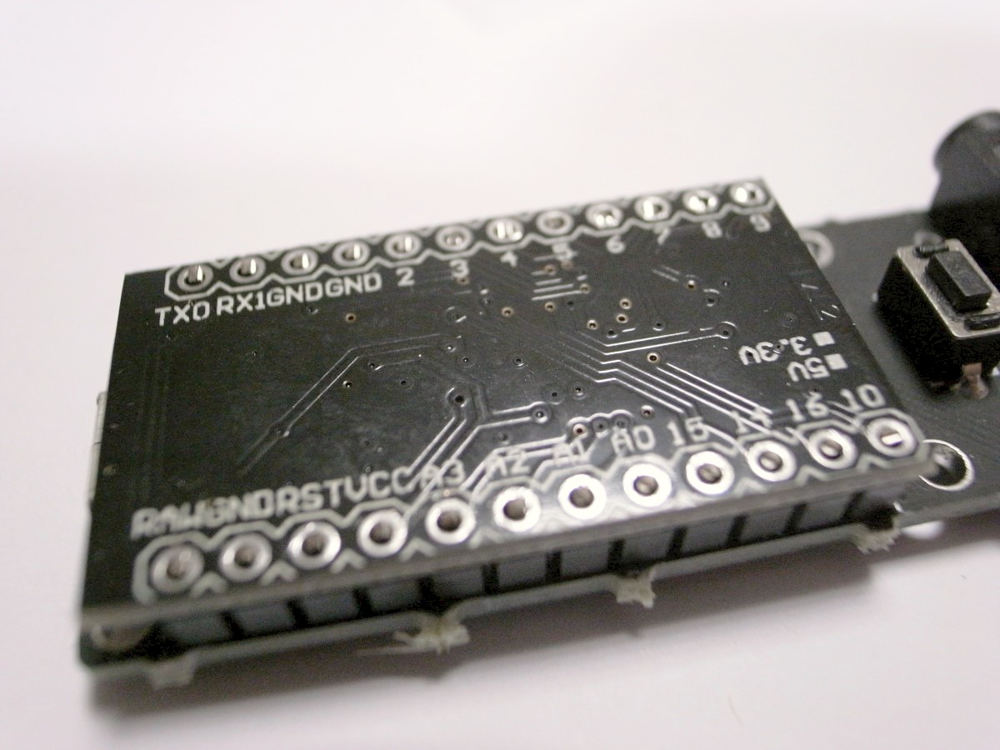
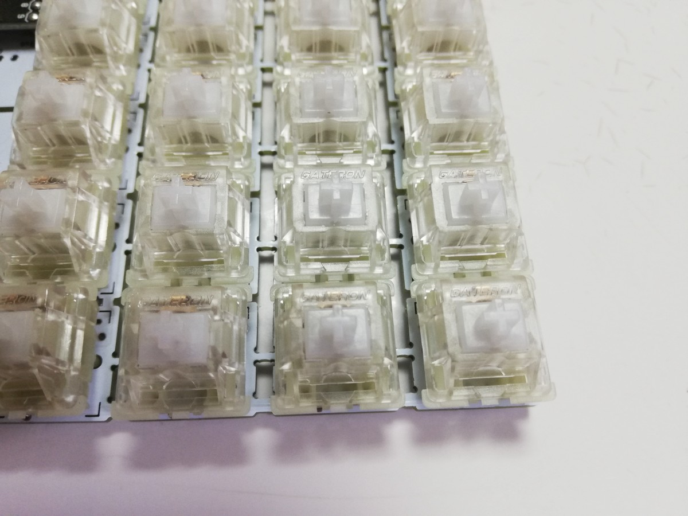

# 15 Key 2 Knob Keypad


<!-- TOC -->

- [15 Key 2 Knob Keypad](#15-key-2-knob-keypad)
    - [必要なパーツ](#必要なパーツ)
    - [使用する道具、消耗品](#使用する道具消耗品)
    - [ビルドガイド](#ビルドガイド)
        - [Pro Microのもげ防止加工](#pro-microのもげ防止加工)
        - [基板のカット](#基板のカット)
        - [基板側面のヤスリがけ](#基板側面のヤスリがけ)
        - [はんだ付けのイメージトレーニング](#はんだ付けのイメージトレーニング)
        - [ダイオードの取り付け](#ダイオードの取り付け)
        - [PCBソケットの取り付け](#pcbソケットの取り付け)
        - [GNDのジャンパ](#gndのジャンパ)
        - [リセットスイッチの取り付け](#リセットスイッチの取り付け)
        - [Pro Microの取り付け](#pro-microの取り付け)
        - [ロータリーエンコーダーの取り付け](#ロータリーエンコーダーの取り付け)
        - [キースイッチの取り付け](#キースイッチの取り付け)
        - [キーキャップの取り付け](#キーキャップの取り付け)
        - [ゴム足の取り付け](#ゴム足の取り付け)
        - [ファームウェアの書き込み](#ファームウェアの書き込み)
    - [トラブルシューティング](#トラブルシューティング)
    - [補足:トッププレートを付ける場合](#補足トッププレートを付ける場合)
        - [必要なパーツ](#必要なパーツ-1)
        - [トッププレートの取り付け](#トッププレートの取り付け)
        - [カバープレートの取り付け](#カバープレートの取り付け)

<!-- /TOC -->

## 必要なパーツ

| 名前 | 数 | 備考 | 調達先の例 | 参考価格（送料込） |
|:-|:-|:-|--|--|
| SU120 自作キーボード用基板（マクロパッドセット） | 1つ | リセットスイッチ1、ダイオード20、ゴム足4が含まれています | https://talpkeyboard.stores.jp/items/5e7eda9b2a9a4265048aed0f | 550円 |
| Pro Micro | 1個 | スルーホールをZigzag仕様にしてあるのでコンスルーではなく普通の付属ピンヘッダを使います | https://talpkeyboard.stores.jp/items/5b24504ba6e6ee7ec60063e3 | 550円 |
| ロータリーエンコーダー（ツマミ付） | 2個 | ロータリーエンコーダーを付けない場合は不要です | https://talpkeyboard.stores.jp/items/5ecb804d55fa035d98011385 | 200円×2 |
| Kailh PCBソケット MX用 または Choc用 | 15個 | Gateronのソケットはキースイッチの端子がちゃんと嵌まらなかったときに壊れやすいという情報がありますので、どちらかというとKailhをお勧めします | MX用 https://talpkeyboard.stores.jp/items/5e02c5405b120c792616bcf9 | 10個で150円×2 |
| 5ピン仕様のキースイッチ MX用 または Choc用 | 15個 |  | MX用 https://talpkeyboard.stores.jp/?category_id=59cf8860ed05e668db003f5d | 10個で450円～×2 |
| キーキャップ MX用 または Choc用 | 15個 |  | MX用 https://talpkeyboard.stores.jp/?category_id=59e2acfaed05e644fd004008 | 2個で110円～×8 |
| Micro USBケーブル | 1本 | 通信ができるもの | ダイソー | 110円 |
| 計 |  |  |  | 3,990円（送料300円含む） |

基板、パーツを個々に集める場合は[SU120 パーツリスト](../common/bom_list_jp.md)をご覧ください。

## 使用する道具、消耗品

[使用する道具、消耗品](../common/tool_guide_jp.md)におすすめの道具類、注意事項等をまとめましたのでご覧ください。

## ビルドガイド

### Pro Microのもげ防止加工

Pro Microにエポキシ接着剤を盛って、簡単にはもげないようにします。

参考1:[ProMicroのモゲ防止ついでにQMK_Firmwareを書き込む - Qiita](https://qiita.com/hdbx/items/2f3e4ddfcadda2a5578e)
参考2:[もげ予防 - Self-Made Keyboards in Japan](https://scrapbox.io/self-made-kbds-ja/%E3%82%82%E3%81%92%E4%BA%88%E9%98%B2)

エポキシ接着剤の2液を混ぜます。


接着剤を付け始める前にMicro USBコネクタを横から見てください。側面に穴が開いています。この穴に接着剤が入ると端子が入らなくなったり、入りにくくなったりします。


この穴を避けて、つまようじなどで接着剤を盛っていきます。


乾くまで置いておきます。

### 基板のカット

下の図のように、ニッパーで切っていきます。トッププレートを付けない場合は左側のみです。


ニッパーで表裏に切れ目を入れてから手で折り割ってください。


### 基板側面のヤスリがけ

机に紙ヤスリを置き、その上で基板のバリがある側面をヤスリがけします。粗目だけでも結構きれいになります。お好みで細目までかけてもよいです。




### はんだ付けのイメージトレーニング

はんだ付けに慣れている方は次の項に進んでください。

全くはんだ付けをしたことがなかったり、数年ぶりにはんだ付けをする場合は、以下の動画が参考になります。

- [はんだ付けの詳細.m2p - YouTube](https://www.youtube.com/watch?v=ZA-ehWjRfYM)

- [リード型（アキシャル）抵抗のはんだ付けお手本（体験用基板を使用）効果音 - YouTube](https://www.youtube.com/watch?v=oq3Q3n57-B0)

- 表面実装ダイオードを使う場合: [チップ抵抗のはんだ付けと、はんだ量の調整（体験用基板を使用） - YouTube](https://www.youtube.com/watch?v=vqKKElJ1vw0&feature=youtu.be)

- [基礎からわかる！自キ入門講座 第8回「自作キーボードのつくりかた #2」 - YouTube](https://www.youtube.com/watch?v=LOC53FeU-QM&t=999)

### ダイオードの取り付け

各キースイッチの端の17箇所にダイオードを取り付けます。

キースイッチの枠が描いてあるほうが基板の表で、Kailh PCBソケットの枠が描いてあるほうが裏です。

ダイオードは、以下の理由で基板の裏に付けることを推奨します

- スタビライザーを装着するキースイッチそばのダイオードを表側に付けるとスタビライザーと干渉する。

- ロープロファイルスイッチでトッププレートを付けたい場合はダイオードを表側に付けると干渉する

  は、ダイオードを裏側に取り付け、表側に出た足をカットしてからハンダ付けしてください。表面実装ダイオードを裏側にハンダ付けしてもいいです。

なお、ロープロファイルスイッチでトッププレートを付けたい場合は、ダイオードの表側に出た足をカットしてからハンダ付けするか、表面実装ダイオードを裏面で使ってください。

ダイオードの足は、指で根本付近を曲げます。はじめに1つだけダイオードを曲げて穴に差し込んでみて、うまくいく曲げ具合を確認して残りのダイオードを同じように曲げてください。

ダイオードの黒くなっている側が、基板の図の二重線の側になるように差し込みます。


全てのダイオードを配置した後、マスキングテープで浮かないようにカバーしておきます。


基板をひっくり返してダイオードを全てハンダ付けし、ニッパーで足を切ります。ダイオードの足を切ってからハンダ付けしても構いません。私はハンダ付けのときに周りの足が邪魔なのと、後がきれいになるので、最近はカットしてからハンダ付けするようにしています。


### PCBソケットの取り付け

基板の裏の印刷された枠に合うようにPCBソケットを配置します。
CherryMX用のPCBソケットを置く場合は、間違った向きに置かないように注意してください。間違った向きに取り付けるとあとでキースイッチが入りません。


PCBソケット両端の金属部分をハンダ付けします。

ハンダ付け不良のリスクを減らすために、事前に片側のみハンダを盛る→ソケットを置いて、ハンダごてで押し付ける→反対側をはんだ付けする、という手順がおすすめです。


### GNDのジャンパ

基板の裏側のジャンパ3箇所をハンダ付けします。**表側にもジャンパがありますが、裏側のみハンダ付けします**。


ハンダを盛ってから間を繋いでください。どうしてもうまくいかない場合はダイオードの切れ端を使って繋いでも構いません。


### リセットスイッチの取り付け

基板の表側からタクトスイッチをはめ込みます。


裏返してハンダ付けします。

### Pro Microの取り付け

基板の表側のPro Micro設置部分の2箇所に、Pro Microに付属している12ピンのピンヘッダの短い側を根本まで差し込みます。


スルーホールがジグザグになっているので、少し入れにくくなっています。ゆっくり押し込んでください。

ピンヘッダにPro Microを差し込みます。**Pro Microの裏面（平らなほう）が上になるように、またマイクロUSBが基板端になるように**します。

**向きを間違えるとリカバリーが大変です。表裏、左右をよく確認してください。**

ニッパーでピンヘッダの足を切ってから、Pro Microとピンヘッダをハンダ付けします。まず四隅をハンダ付けし、横から見てピンヘッダとの間に隙間があれば押さえながらハンダを温めて浮かないようにします。そのあと、順番に全てハンダ付けします。



基板とピンヘッダはジグザグのスルーホールで接触しているため、ハンダ付けはしなくても基本大丈夫だと思いますが、接触不良が気になる場合ははんだ付けしてください。

|            | 基板とピンヘッダをはんだ付けしない                           | 基板とピンヘッダをはんだ付けする                             |
| ---------- | ------------------------------------------------------------ | ------------------------------------------------------------ |
| メリット   | はんだ付け箇所が減る<br />Pro MicroのMicro USBがモゲたときに交換できる | キーが反応しないとき、接触不良をまず疑うべき箇所が減らせる   |
| デメリット | 接触不良により行単位、列単位でキーが反応しない場合がある     | はんだ付け箇所が増える<br />Pro MicroのMicro USBがモゲたときに交換が難しい |

### ロータリーエンコーダーの取り付け

表側から差し込み、裏側をはんだ付けします。まずは対角の2箇所をハンダ付けし、傾いている場合はハンダを温めて傾きを解消してから残りの箇所をハンダ付けしてください。


そのあと、ロータリーエンコーダーにキャップを取り付けます。

### キースイッチの取り付け

表側から差し込みます。キースイッチの足が曲がっている場合はまっすぐにしてから差し込んでください。



**キースイッチを嵌めるときに抵抗感を感じたら、キースイッチの足が曲がっていてきちんとソケットに入っていません。無理に押し込まず、一度外して足が曲がっていないか確認してください。**

トッププレート無しの場合はこの感覚が分かりやすいのですが、トッププレートがあるとトッププレートへ差し込む際の抵抗とソケットに足が嵌らないときの抵抗感が似ていて分かりにくいです。ちょっとおかしいなと感じたら、無理に押し込まないで確認してみてください。


### キーキャップの取り付け

キースイッチにキーキャップをはめます。


### ゴム足の取り付け

ゴム足を裏面に取り付けます。ソケットやキースイッチに接触する場合はハサミで切ってから取り付けます。


試打してみて、基板のたわみが気になればゴム足を増やしてください。

### ファームウェアの書き込み

以下のリンク先を参考にして、QMK Firmwareのビルド環境を用意します。

- Windows
  - [QMKビルド環境の構築(Windows Msys2編)](https://gist.github.com/e3w2q/4bc86e531d1c893d3d13af3e9895a94a)
- macOS
  - [セットアップ - QMK Firmware](https://docs.qmk.fm/#/ja/newbs_getting_started?id=macos)
- Linux
  - [セットアップ - QMK Firmware](https://docs.qmk.fm/#/ja/newbs_getting_started?id=linux)

構築中、

```
qmk setup
```

と入力する代わりに

```
qmk setup e3w2q/qmk_firmware --branch e3w2q
```

と入力してください。

または、`qmk setup`した後に、`C:\Users\USER_NAME\qmk_firmware\keyboards`配下に[https://github.com/e3w2q/qmk_firmware/tree/e3w2q/keyboards/e3w2q](https://github.com/e3w2q/qmk_firmware/tree/e3w2q/keyboards/e3w2q)以下をコピーしてもよいです。

用意されたキーマップを書き込むには以下を実行します。

```
qmk flash -kb e3w2q/su120/rev1_4knob -km sasami15+2
```

**Detecting USB port, reset your controller now...** と表示されたらPro Micro横にハンダ付けしたリセットスイッチを押すと書き込みが始まります。

[QMK Configuratorのテストモード](https://config.qmk.fm/#/test)でキー入力が行えるかテストしてください。

以前は[KeyboardTester.com](https://www.keyboardtester.com/tester.html)をお勧めしていましたが、[QMK Configuratorのテストモード](https://config.qmk.fm/#/test)のほうが見やすいです。


## トラブルシューティング

- 特定のキーが反応しない
  - キースイッチの足がソケットにきちんと嵌っていない場合があります。一度キースイッチを外して、足がUの字に曲がっていないか確認してみてください。
  - ソケットがきちんとはんだ付けされていないことがあります。親指と人差し指で、キースイッチとソケットを挟み込んでスイッチを強めに押し込んだら入力できる場合は、ソケットをはんだ付けし直してください。
  - 可能性は低いですが、キースイッチ不良の場合もありえます。違うキースイッチに差し替えて入力できるか試してみてください。キースイッチの代わりにピンセットの先をソケットに入れてみて文字が入力されるか確認してみるのもよいでしょう。
- 行、列単位でキーが反応しない
  - Pro Microの足と基盤のZigzag穴とがうまく導通していない可能性があります。該当する行または列のPro Microの足を基盤のスルーホールの壁に押し付けた状態でキー入力ができるか試してください。この状態でキー入力ができる場合は、きちんと導通するようにPro Microの足が基盤の穴の壁に接するようにちょっと曲げてから差し込んでみてください。はんだ付けしてしまうのもよいです。

## 補足:トッププレートを付ける場合

キースイッチのぐらつきが気になる場合はトッププレートを付けるとよくなります。

### 必要なパーツ

| 名前                                   | 数   | 備考                                                | 調達先の例                                                   | 参考価格（送料込）    |
| :------------------------------------- | :--- | :-------------------------------------------------- | ------------------------------------------------------------ | --------------------- |
| SU120 Plate PCB                        | 1枚  | [入手方法はこちら](../common/pcb_order_guide_jp.md) | [Elecrow Online Store](https://www.elecrow.com/pcb-manufacturing.html) | 10枚で1,400円($12.94) |
| M2ネジ 鍋ネジ ネジ長3mm                | 8本  |                                                     | https://ja.aliexpress.com/item/32948978177.html              | 100本で85円($0.76)    |
| M2スペーサー オス-メス スペーサー長3mm | 4個  |                                                     | https://ja.aliexpress.com/item/33022872348.html              | 50個で95円($0.85)     |
| M2ナット                               | 4個  |                                                     | https://ja.aliexpress.com/item/33022872348.html              | 100個で65円($0.59)    |
| M2スペーサー メス-メス スペーサー長5mm | 2個  |                                                     | https://ja.aliexpress.com/item/33022872348.html              | 50個で95円($0.87)     |
| 計                                     |      |                                                     |                                                              | 1,675円               |

### トッププレートの取り付け

キースイッチを外し、外周から一つ内側の4箇所にM2スペーサー（オス-メス）を差し込み、裏側からM2ナットで留めます。


トッププレートを置き、M2ネジとスペーサーでトッププレートを挟んでネジ留めします。


### カバープレートの取り付け

Pro MicroのカバープレートをM2ネジとM2スペーサー5mmで挟んでネジ留めします。

カバープレートは表と裏でデザインが違っているので、好きなほうを表面としてください。


そのあと、基板裏からM2ネジでカバープレートを取り付けます。

